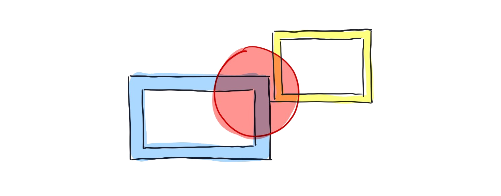

Two concepts that I've been thinking about a lot (and briefly touched on in issue [#3](https://buttondown.email/jacky/archive/spider-man-neurons-hearing-fractals-and-fulfilment) and [#4](https://buttondown.email/jacky/archive/sun-sneezing-infrastructure-moderation-and-why) of my newsletter) are *framing* and *context collapse*. 

Behind both of these concepts is the idea that **people present themselves in different ways in different environments.** On more than a few occasions, I have caught myself behaving differently throughout the day as I interacted with various people and subsequently asked myself "why?" In these cases, I don't feel like I'm being disingenuous or a different person than who I am. Rather, I feel like I'm only portraying a subset or a *frame* of who I truly am.

## What's (not) in the frame
In this [vlogbrothers video from March](https://www.youtube.com/watch?v=ZRZuEGuU_es), John talks about the metaphorical *frame* or context in which people present themselves. This echoed a lot of the earlier thoughts I had that we choose to present our selves a certain way in front of others (even if subconsciously). However, in doing so, we are inadvertently portraying an incomplete picture -- we ignore what's outside the frame.

Modern influencers are a great example of this. They shape what we view as normal through these picturesque and perfect lifestyles they portray on their glamorized Instagram feeds. Unfortunately in doing so, we begin mentally accepting that this sculpted normal is how regular people live their lives and creates incredibly unhealthy expectations of what day-to-day life looks like. What doesn't get shown in these feeds are the off-days and hours of work put into making that perfect photo or 15 second video possible.

> "I mean of course the central trick of the social internet, is that whenever you make something, you choose what’s inside the frame, but as viewers the rest of us can’t help but believe what’s inside the frame, because it’s literally all we can see"

In the video, there's a specifically poignant section in the middle where he stops his signature jump-cut heavy editing style and goes on to talk about his speech particularities. The difference is almost immediately noticeable and uses it to emphasize that this is what is *normally outside of the frame*. 

We have these set identities that we've become used to portraying in certain scenarios that when behaviour deviates from these expectations, it feels *weird*.

## Context Separation

Why do humans tend to act differently in different environments? I think two key aspects of behaviour play a role here:

### Behaviour is sticky
It is easier to travel along a path well-travelled than one covered in weeds and bush. If you do something once, it becomes easier to do it again. Similarly, doing something with a person once means it becomes easier to repeat that same behaviour with the person again. In some ways, this is Newton's First Law but applied to behaviour. If you do something one way, you are likely to keep doing things in that way unless encouraged to do otherwise.

### Individuals tend to conform to group norms
In 1951, Solomon Asch conducted [an experiment](https://en.wikipedia.org/wiki/Asch_conformity_experiments) to investigate the extend of social pressures can affect a person's behaviour.
In this experiment, there was a clearly obvious answer to the question asked (which line is the longest out of the three given). In an individual setting, less than 1% of participants gave the wrong answer. However, when put in a room of actors which had a set of predetermined (but incorrect) answers, around 75% of all participants gave at least one incorrect answer in 12 trials.

People conform for two main reasons:

1. They want to fit in with the group **(normative influence)**
2. They believe the group is better informed than they are **(informational influence)**

We have so far done very well as a species because of our ability to work in groups and [think collectively](/posts/collaborative-thinking)). Even as children, when we get hurt, we look to authority figures around us to see how to react. If our mother comes to us expressing worry and concern, we cry. If everyone around us continues to play as if everything is normal, we will brush aside the injury and continue to play with the group.

Historically, having different behaviours in different contexts may have been evolutionarily beneficial, helping us to better collaborate and form connections with each other without causing undue conflict. 

> "For your ancestors, the most dangerous threat to survival was not being eaten by a lion, but not getting the social vibe of your group and being excluded. Being together meant survival, being alone meant death." - [Kurzgesagt](https://www.youtube.com/watch?v=n3Xv_g3g-mA)

Our ability to 'frame' ourselves different depending on the social situation we're in likely stemmed from this behaviour too.

## Context Collapse

Facebook friends. Twitter followers. LinkedIn connections. We have all these social media apps that seeming all have the same purpose: to communicate and connect. Why is it that we all have *slightly* different personalities across all of these?

I think the core tenet is that different apps curate different types of communities and thus social contexts. As a result, we try to separate these contexts in the best way we know how to: act differently. Yet, because of just how easy it is to jump from social network to social network, the *overlap* in target audience between these apps becomes very large. As a result, all of these different contexts 'collapse' and it becomes increasingly difficult to maintain these separate personalities.

> "when your different friend groups are meeting and you need to combine the different personalities you maintain around them"

This phenomenon is called [context collapse](https://www.rewire.org/context-collapse-online/) and it is not unique to just digital spaces (think large gatherings like graduation or weddings), but the permeability of these digital spaces means that the frequency at which this happens is vastly increased.

When experiencing context collapse, talking to anyone becomes very difficult. Smaller groups, by nature, have more commonalities to talk about, whether that be interests, music taste, place of study, or shared goals. In the massive groups that form when we experience context collapse, the amount of overlap between anyone is miniscule. How are you supposed to have any sort of meaningful connection when the only thing you share in common on the platform is that you 'know' each other?

## Centrifuging Contexts
I've noticed three main ways people are tackling context collapse (whether consciously or subconsciously).

1. **Lowest Common Denominator**. Only making posts that anybody will be able to understand and relate to, staying away from controversial or overly personal topics.

2. **Fragmentation**. Purposefully having conversations in places where your audience is smaller, like group chats, direct messages, or small communities. In these cases, the specific context and audience is well-defined. More users are also turning to 'finstas' and have accounts focused for a closed group of friends and family rather than the entire public internet.  

3. **Realtime**. Platforms and individuals are leaning more towards *ephemeral* content, like stories or streaming. Because this content is intended to be viewed live, the effective audience is much smaller.

I think in part, this is why nobody has been successful in creating a single social network to replace all of the existing apps. As humans, we want the ability to closely connect with people, and context collapses makes that exceedingly difficult.

By re-separating our contexts, hopefully we can normalize having different interests and being different on different platforms and move away from the baseline assumption that "oh I know you from Twitter therefore I must know your entire personality."